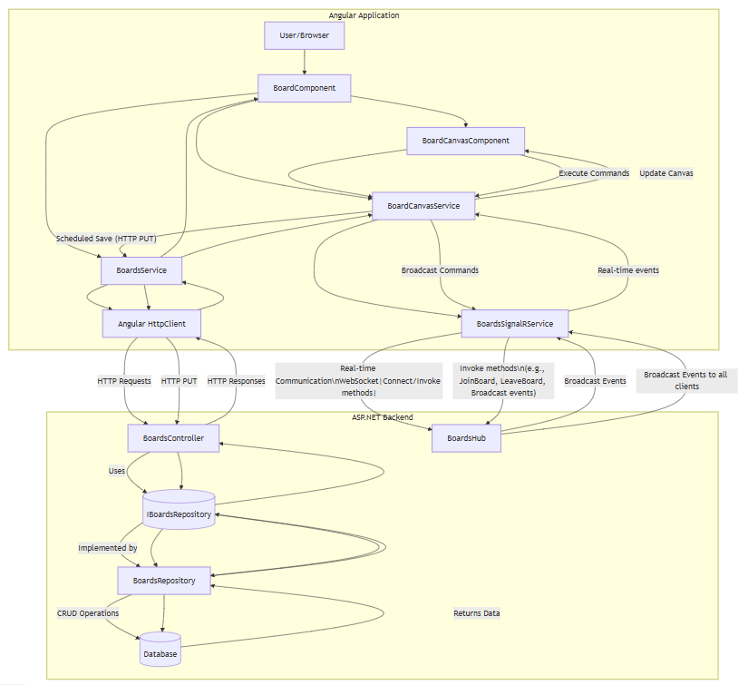

# StormSpace - Event Storming Board

StormSpace is a collaborative interactive Event Storming web application. StormSpace allows multiple users to collaborate on an interactive whiteboard and save their progress.

- Management of multiple Event Storming boards
- Create, move, resize and edit sticky notes
- Sticky note colours for each Event Storming type
- Real-time collaboration between multiple users
- Export/Import boards as JSON
- Export boards to image
- Undo/Redo funcionality
- Multi-select and copy/paste


## Technologies Used

StormSpace is built using the following technologies:
- **Frontend**: Angular 18, Material, HTML Canvas
- **Backend**: ASP.NET 8
- **Real-time communication**: SignalR

## Run Docker Image

StormSpace can be run through Docker using the following command:

```bash
docker run -it -p 8080:8080 --rm mabentley/stormspace
```

Access StormSpace: [http://localhost:8080](http://localhost:8080)

## Architecture

StormSpace is a 2-tier application with a frontend and backend. The frontend is built using Angular and communicates with the backend using REST APIs. The backend is built using ASP.NET and uses a SignalR Hub for real-time communication back to Angular.

Boards are stored in a Memory Cache with a sliding expiry of 60 minutes.

