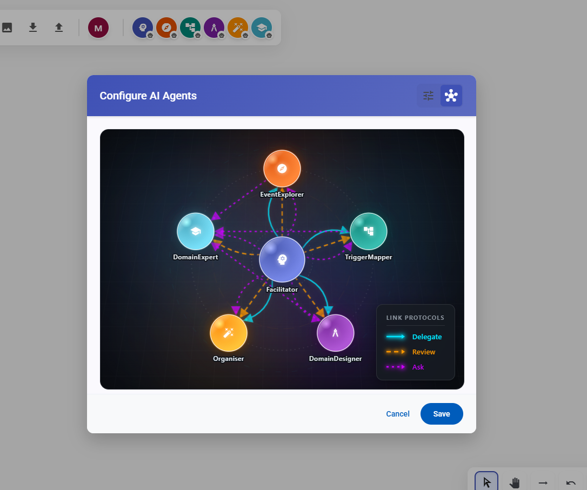
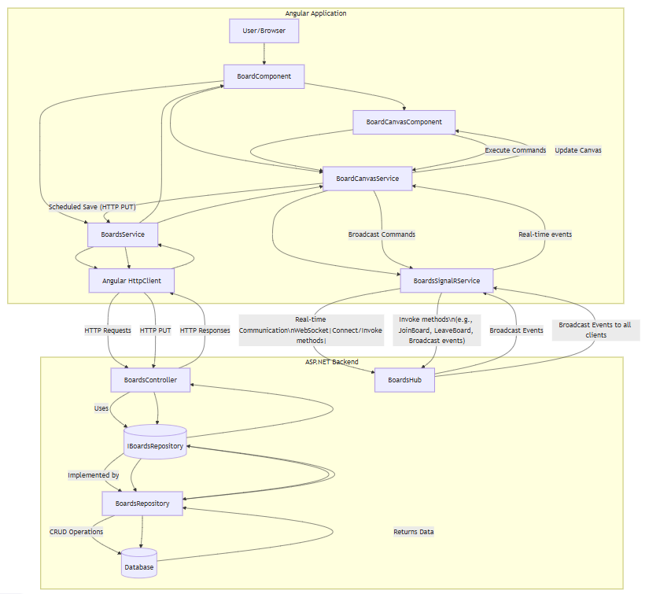

# StormSpace - Event Storming Board

StormSpace is a collaborative interactive Event Storming web application. StormSpace allows multiple users to collaborate on an interactive whiteboard and save their progress.

- Management of multiple Event Storming boards
- Create, move, resize and edit sticky notes
- Sticky note colours for each Event Storming type
- Real-time collaboration between multiple users
- Export/Import boards as JSON
- Export boards to image
- Undo/Redo funcionality
- Multi-select and copy/paste
- AI-powered multi-agent facilitation


## AI Agents

StormSpace includes an AI-powered facilitation system built on the [Microsoft Agent Framework](https://github.com/microsoft/agents) and Azure OpenAI. A team of specialized agents collaborates to guide users through Event Storming sessions.



### Agent Roles

Agent roles are fully configurable per board — you can change models, prompts, active phases, and interaction protocols through the UI. The following are the defaults:

| Agent | Phase | Role |
|---|---|---|
| **Facilitator** | All | Central orchestrator — the only agent that speaks directly to users. Manages session context, phases, and delegates work to specialists. |
| **EventExplorer** | Identify Events | Proposes candidate domain events and flags concerns. Consults the DomainExpert before creating notes. |
| **TriggerMapper** | Commands & Policies | Maps triggers to events — determines whether each event is caused by a user command, automated policy, external system, or time. Builds cluster patterns on the board. |
| **DomainDesigner** | Aggregates, Break It Down | Identifies aggregates and ownership boundaries. In later phases, recommends bounded contexts and subdomains. |
| **Organiser** | All (post-creation) | Tidies and lays out the board after specialists make changes. Moves notes into correct positions without creating or deleting content. |
| **DomainExpert** | All | Subject matter expert that answers domain questions from other agents. Does not modify the board — purely advisory. |

### How It Works

- **Chat**: Users can chat with the Facilitator directly to ask questions, request changes, or get guidance on the Event Storming process.
- **Autonomous Mode**: When enabled, the agents run autonomously in the background — observing user activity, proposing domain events, and populating the board without manual prompting. Rate limiting and activity debouncing ensure the agents don't overwhelm the session.
- **Phase-Guided Workflow**: The Facilitator progresses through Event Storming phases — Set Context, Identify Events, Add Commands & Policies, Define Aggregates, and Break It Down — tailoring its guidance and agent selection to each phase.
- **Configurable**: Agent models, prompts, and interaction protocols can be configured per board through the UI.

### Agent Integration

The agents interact through three protocols (visible in the configuration diagram):

- **Delegate**: The Facilitator delegates board-changing work to a phase-appropriate specialist (e.g. EventExplorer in the Identify Events phase). The specialist creates notes directly on the board, and the Organiser tidies the layout afterwards.
- **Review**: The Facilitator requests a non-blocking advisory review from a specialist. The reviewer analyses the board and returns feedback — no board changes are made.
- **Ask**: Any agent can ask the DomainExpert (or another agent) a focused question to get domain clarification before acting. This keeps domain knowledge flowing between agents without coupling them.

All board mutations flow through a `BoardEventPipeline` that broadcasts changes in real time via SignalR, so every user sees agent actions as they happen.

## Technologies Used

StormSpace is built using the following technologies:
- **Frontend**: Angular 21, Material, HTML Canvas
- **Backend**: ASP.NET 10
- **Real-time communication**: SignalR
- **AI**: Microsoft Agent Framework, Azure OpenAI

## Run Docker Image

StormSpace can be run through Docker using the following command:

```bash
docker run -it -p 8080:8080 --rm mabentley/stormspace
```

Access StormSpace: [http://localhost:8080](http://localhost:8080)

## Architecture

StormSpace is a 2-tier application with a frontend and backend. The frontend is built using Angular and communicates with the backend using REST APIs. The backend is built using ASP.NET and uses a SignalR Hub for real-time communication back to Angular.

Boards are stored in a Memory Cache with a sliding expiry of 60 minutes.

